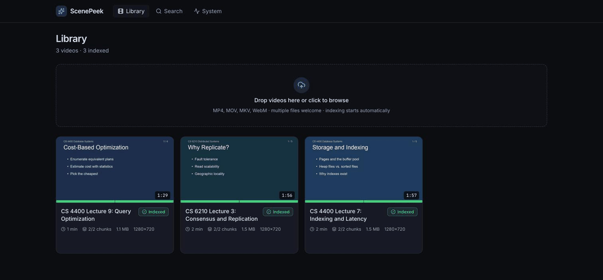
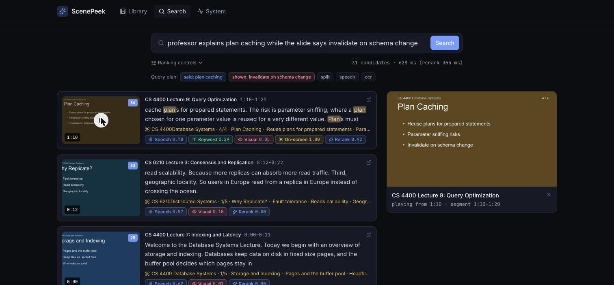
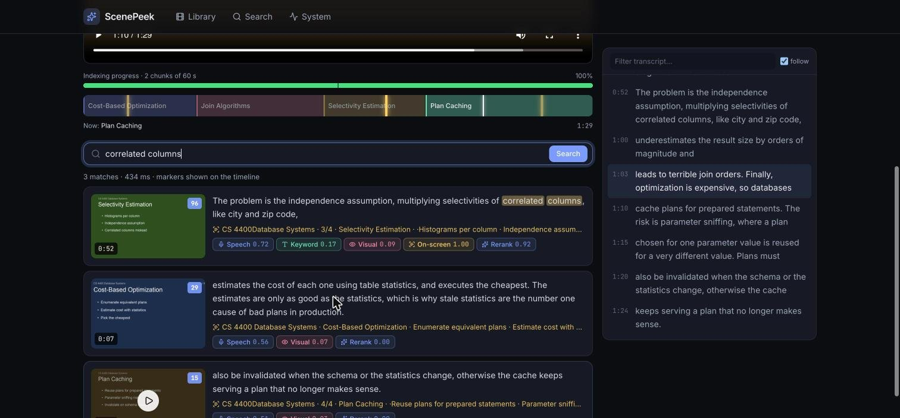
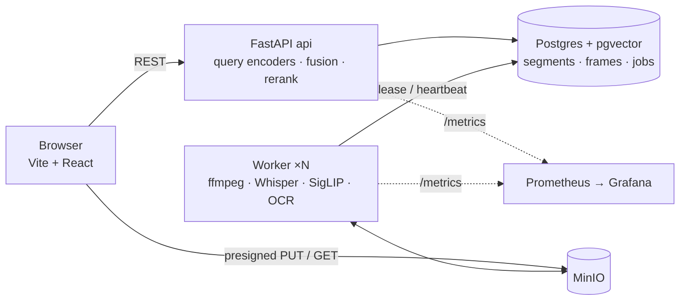

# ScenePeek

**Find any moment in your videos with natural language.** ScenePeek indexes what was *said*, what was *shown*, and what was *on screen*, then answers queries like

- "where the professor explains B+ tree leaf nodes"
- "mentions latency while showing an architecture diagram"
- "the slide that lists the ACID properties"

with ranked, timestamp-level results you can play instantly.



<p align="center"><sub>Library with live indexing progress → multimodal query plan and per-modality match signals → topic timeline with search markers → system metrics</sub></p>

## What's inside

| | |
|---|---|
| **Multimodal indexing** | Whisper transcripts with word timings · SigLIP frame embeddings · OCR of slides/on-screen text · perceptual-hash keyframe selection |
| **Multi-stage retrieval** | Query planner → 4 parallel candidate lanes (dense text, BM25-style FTS, dense visual, OCR FTS + trigram) → weighted RRF fusion → cross-encoder rerank → temporal NMS |
| **Async pipeline** | Postgres-backed job queue (`FOR UPDATE SKIP LOCKED`), heartbeats + reaper, exponential backoff, idempotent per-chunk stages. Kill a worker mid-job and it recovers. |
| **Incremental indexing** | 60-second chunks become searchable the moment they commit — long videos are searchable within ~20 s of upload |
| **Semantic timeline** | Topic segmentation from embedding drift + slide-heading changes; labels from slide titles or KeyBERT-style keyphrases |
| **Evaluation** | Dataset format with timestamp-range relevance, Recall@k / MRR / nDCG, config-driven A/B comparisons, synthetic dataset generator with auto-labels |
| **Observability** | Prometheus metrics, Grafana dashboard, and an in-app System page (throughput, time-to-first-searchable, p50/p95 latencies, workers, failures) |

Everything runs locally on free, open models. No hosted LLM or vision API is required (an optional Ollama hook improves query decomposition and topic titles when present).

## Screens

| Search: "professor explains plan caching *while the slide says* invalidate on schema change" | Video detail: topic timeline, transcript, in-video search markers |
|---|---|
|  |  |

## Architecture



**Processing** — `probe_video` (ffprobe, h264 web rendition, poster, audio, chunk plan) → per chunk: `extract_chunk` (1 fps sampling, phash scene-change keyframes, upload) → `index_chunk` (transcribe padded slice, snap ~10 s segments to utterance boundaries, batch-embed text + frames, OCR, **one atomic commit**) → `build_timeline` once every chunk is terminal. Chunk 0 of every video has the highest priority, so concurrent uploads all become searchable quickly.

**Search** — the planner splits a query into speech / visual / on-screen sub-queries using cue heuristics ("while showing…", quoted phrases, "someone holding…") and adjusts modality weights. Candidate lanes run in parallel sessions and are fused with weighted reciprocal-rank fusion; the top 30 go through `bge-reranker-base`; temporal non-max suppression keeps one hit per moment. Every hit carries per-modality scores so the UI can explain *why* it matched.

More detail: [docs/architecture.md](docs/architecture.md).

## Models (all local)

| Role | Model | Notes |
|---|---|---|
| Speech-to-text | `faster-whisper` small.en (int8) | word timestamps + VAD; `mlx-whisper` backend optional |
| Vision-language | `google/siglip-base-patch16-224` | image tower in the worker, text tower in the API |
| Text embedding | `BAAI/bge-small-en-v1.5` | 384-d, HNSW cosine in pgvector |
| OCR | RapidOCR (ONNX) | + word re-segmentation for dropped spaces |
| Reranker | `BAAI/bge-reranker-base` | cross-encoder on transcript + OCR |
| Topic labels | slide headings / KeyBERT-style MMR | optional Ollama titles |

## Quick start

Requirements: Docker, ffmpeg, [uv](https://docs.astral.sh/uv/), Node 20+. On Apple Silicon the worker runs natively so it can use the GPU (MPS); everything else runs in Compose.

```sh
cp .env.example .env
make install            # backend (uv, with ML extras) + frontend (npm)
make up                 # postgres + minio + api (Docker) + web dev server
make worker             # start one worker on the host (N=3 for three)
open http://localhost:5173
```

Seed it with two synthetic narrated lectures (macOS `say` + ffmpeg, no downloads) and run the evaluation:

```sh
python scripts/make_synthetic.py                 # eval/videos/*.mp4 + eval/dataset.yaml
scripts/upload.sh eval/videos/db_lecture.mp4 "CS 4400 Lecture 7: Indexing and Latency"
scripts/upload.sh eval/videos/dist_lecture.mp4 "CS 6210 Lecture 3: Consensus and Replication"
make eval                                        # Recall@k / MRR / nDCG for the default config
```

For the fastest searches during a demo run the API on the host too (`make api-dev`) so reranking uses the GPU: ~100 ms per query vs ~1.2 s on CPU in Docker.

Optional dashboards: `make observability` → Grafana at http://localhost:3001.

## Evaluation

`eval/dataset.yaml` lists videos and queries with relevant `{video, start_s, end_s}` ranges; `eval/configs/*.yaml` override any setting (fusion method, modality weights, rerank on/off…). A hit counts if its span overlaps a relevant range (±3 s tolerance).

```sh
cd backend
uv run scenepeek eval run -c ../eval/configs/text_only.yaml
uv run scenepeek eval run -c ../eval/configs/default.yaml
uv run scenepeek eval compare ../eval/reports/text_only.json ../eval/reports/hybrid_no_rerank.json ../eval/reports/default.json
```

Results on the synthetic set (2 lectures, 23 queries across speech / lexical / OCR / multimodal):

| config | MRR | R@1 | R@5 | nDCG@10 | p50 latency |
|---|---|---|---|---|---|
| dense text only | 0.906 | 0.826 | 1.000 | 0.930 | 23 ms |
| hybrid (text + FTS + visual + OCR), no rerank | 0.957 | 0.913 | 1.000 | 0.968 | 23 ms |
| **hybrid + cross-encoder rerank** (default) | **1.000** | **1.000** | 1.000 | 1.000 | 189 ms |

The synthetic set is deliberately easy; its value is as a regression harness. Add real videos and hand-labelled queries to `eval/dataset.yaml` to measure something harder (`scripts/download_eval_videos.py` fetches CC-licensed lectures and clips with `yt-dlp`).

## Measured on an M3 Pro (18 GB)

| metric | value |
|---|---|
| Indexing speed (warm worker, 1 process) | ≈ 6× realtime → ~10 min per hour of video |
| Time to first searchable segment | ~20 s after upload |
| Search latency (host, MPS) | p50 ≈ 100 ms with rerank, ≈ 30 ms without |
| Search latency (Docker, CPU) | ≈ 1.2 s with rerank (top-15), ≈ 110 ms without |
| 1 → 2 workers, two 2-minute videos | 44 s → 35 s wall (shared GPU; scales better across machines) |
| Crash recovery | SIGKILL mid-chunk → reaper requeues after lease expiry → re-indexed with no duplicate rows |

## Repo layout

```
backend/scenepeek/
  api/        FastAPI routers (videos, search, jobs, metrics)
  jobs/       Postgres queue (lease / heartbeat / retry / reap) + worker loop
  pipeline/   probe → extract → index → timeline stages, chunking, segmentation, keyframes
  ml/         lazy model singletons: whisper, siglip, text_embed, ocr, reranker, keyphrases, llm
  search/     planner, candidate lanes, fusion, rerank, dedup, service
  eval/       dataset, metrics, runner, report
frontend/     Vite + React + TS + Tailwind: Library, Search, Video detail, System
eval/         dataset.yaml, configs/, reports/, videos/
scripts/      make_synthetic.py, upload.sh, bench_workers.sh
docs/         architecture.md, observability/ (Prometheus + Grafana provisioning)
```

## Development

```sh
make test        # pytest (queue tests use a throwaway DB on the compose Postgres)
make lint        # ruff
make api-dev     # API on the host with auto-reload (uses MPS for encoders)
make web-dev     # Vite dev server on the host
docker compose --profile docker-worker up worker   # CPU worker in a container (Linux/GPU hosts)
```
