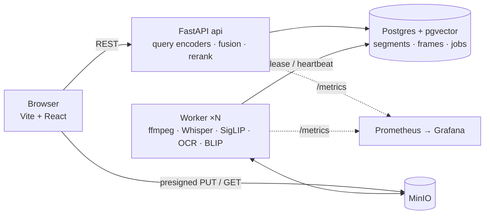

# ScenePeek

[](https://github.com/Veeru102/ScenePeek/actions/workflows/ci.yml)

**Find any moment in your videos with natural language.** ScenePeek indexes what was *said*, what was *shown*, and what was *on screen*, then answers queries like

- "where the professor explains B+ tree leaf nodes"
- "mentions latency while showing an architecture diagram"
- "the slide that lists the ACID properties"

with ranked, timestamp-level results you can play instantly.


<p align="center"><sub>Library with live indexing progress → multimodal query plan and per-modality match signals → topic timeline with search markers → system metrics</sub></p>

## What's inside

| | |
|---|---|
| **Multimodal indexing** | Whisper transcripts with word timings · SigLIP frame embeddings · OCR of slides/on-screen text · BLIP keyframe captions · perceptual-hash keyframe selection |
| **Multi-stage retrieval** | Query planner → up to 5 parallel candidate lanes (dense text, FTS, dense visual, OCR FTS + trigram, captions) → weighted min-max or RRF fusion → cross-encoder rerank → temporal NMS. Every hit explains itself (per-lane scores in the UI). |
| **Async pipeline** | Postgres-backed job queue (`FOR UPDATE SKIP LOCKED`), heartbeats + reaper, DB-clock scheduling, exponential backoff, transcript checkpoints so retries skip ASR. A worker dying mid-job is covered by an automated chaos test. |
| **Incremental indexing** | 60-second chunks become searchable the moment they commit — long videos are searchable within ~20 s of upload |
| **Semantic timeline** | Topic segmentation from embedding drift + slide-heading changes; labels from slide titles or KeyBERT-style keyphrases |
| **Honest evaluation** | Three datasets (synthetic regression set, 119 auto-generated real-video queries, **41 hand-written queries**), per-lane ablations with paired-bootstrap confidence intervals, lane attribution ("which lane actually found it"), a labeling UI, and a negative result reported as such |
| **Observability & CI** | Prometheus metrics, Grafana dashboard, in-app System page; GitHub Actions runs ruff + pytest (real Postgres) + vitest + build |

Everything runs locally on free, open models. No hosted LLM or vision API is required (a local Ollama server is auto-detected and used for query decomposition and topic titles when present).

## Screens

| Search: "professor explains plan caching *while the slide says* invalidate on schema change" | Video detail: topic timeline, transcript, in-video search markers |
|---|---|
|  |  |

## Architecture



**Processing** — `probe_video` (ffprobe, h264 web rendition, poster, audio, chunk plan) → per chunk: `extract_chunk` (1 fps sampling, phash scene-change keyframes, upload) → `index_chunk` (transcribe padded slice, snap ~10 s segments to utterance boundaries, batch-embed text + frames, OCR, caption keyframes, **one atomic commit**; the transcript is checkpointed to storage first) → `build_timeline` once every chunk is terminal. Chunk 0 of every video has the highest priority, so concurrent uploads all become searchable quickly.

**Search** — the planner splits a query into speech / visual / on-screen sub-queries using cue heuristics ("while showing…", quoted phrases, "someone holding…") and adjusts modality weights. Candidate lanes run in parallel sessions (a lane with weight 0 is skipped) and are fused with weighted min-max fusion (RRF available); the top 30 go through `bge-reranker-base`; temporal non-max suppression keeps one hit per moment. Every hit carries per-modality scores so the UI can explain *why* it matched.

More detail: [docs/architecture.md](docs/architecture.md).

## Models (all local)

| Role | Model | Notes |
|---|---|---|
| Speech-to-text | `faster-whisper` small.en (int8) | word timestamps + VAD; `mlx-whisper` backend optional |
| Vision-language | `google/siglip-base-patch16-224` | image tower in the worker, text tower in the API |
| Text embedding | `BAAI/bge-small-en-v1.5` | 384-d, HNSW cosine in pgvector |
| OCR | RapidOCR (ONNX) | + word re-segmentation for dropped spaces |
| Keyframe captions | `Salesforce/blip-image-captioning-base` | indexed per keyframe; **off in ranking by default** (measured, see below) |
| Reranker | `BAAI/bge-reranker-base` | cross-encoder on transcript + OCR |
| Topic labels | slide headings / KeyBERT-style MMR | optional Ollama titles |

## Quick start

Requirements: Docker, ffmpeg, [uv](https://docs.astral.sh/uv/), Node 20+. On Apple Silicon the worker runs natively so it can use the GPU (MPS); everything else runs in Compose.

```sh
cp .env.example .env
make install            # backend (uv, with ML extras) + frontend (npm)
make up                 # postgres + minio + api (Docker) + web dev server
make worker             # start one worker on the host (N=3 for three)
open http://localhost:5173
```

Seed it with two synthetic narrated lectures (macOS `say` + ffmpeg, no downloads) and run the evaluation:

```sh
python scripts/make_synthetic.py                 # eval/videos/*.mp4 + eval/dataset.yaml
scripts/upload.sh eval/videos/db_lecture.mp4 "CS 4400 Lecture 7: Indexing and Latency"
scripts/upload.sh eval/videos/dist_lecture.mp4 "CS 6210 Lecture 3: Consensus and Replication"
make eval                                        # Recall@k / MRR / nDCG for the default config
```

With real videos in `eval/videos/real/` (see `eval/real/sources.yaml`): `uv run scenepeek eval real-upload` indexes them, `real-scan` + `real-auto-review` generate candidate queries, `real-label` opens the hand-labeling UI, and `make eval-real REAL_SET=real_human` runs the ablations.

For the fastest searches during a demo run the API on the host too (`make api-dev`) so reranking uses the GPU: ~300 ms per query across a 3 000-segment library vs ~1.2 s on CPU in Docker.

Optional dashboards: `make observability` → Grafana at http://localhost:3001.

## Evaluation

Three datasets, in increasing order of honesty:

| set | videos | queries | how the queries were made | what it measures |
|---|---|---|---|---|
| synthetic (`eval/dataset.yaml`) | 3 generated lectures | 31 | scripted alongside the videos | a regression harness — deliberately easy, MRR ≈ 1.0 |
| auto-generated real (`eval/real/dataset.yaml`) | 11 real videos (Blender films, MIT OCW lectures, robotics) | 119 | keyphrases / OCR strings pulled from the indexed content by `scenepeek eval real-scan` + heuristic review | near-verbatim recall; **circular** by construction and 89 % speech-derived |
| **hand-written** (`eval/real/human.yaml`) | 9 of those videos | **41** (18 visual, 10 speech, 6 OCR, 7 multi) | a person watched the videos and typed what they would search for (`scenepeek eval real-label`) | real intent, paraphrase, silent scenes — the number to believe |

A hit counts if its span overlaps a relevant range (±3 s). `eval compare` reports paired-bootstrap 95 % confidence intervals on per-query deltas (1000 resamples); **\*** marks a CI that excludes zero. `make eval-real` / `make eval-real REAL_SET=real_human` reproduce every table below.

<!-- eval-tables:begin -->
**Hand-written queries (41, the headline number)**

| configuration | MRR | R@1 | R@5 | R@10 | ΔMRR vs default [95% CI] |
|---|---|---|---|---|---|
| **default** (weighted fusion of text + keyword + visual + OCR, reranked) | **0.506** | 0.415 | 0.634 | 0.658 | — |
| dense text only (no fusion, no rerank) | 0.305 | 0.268 | 0.342 | 0.342 | -0.201 [-0.321, -0.087] **\*** |
| − cross-encoder rerank | 0.492 | 0.390 | 0.634 | 0.658 | -0.013 [-0.065, +0.043] |
| − keyword (FTS) lane | 0.495 | 0.415 | 0.610 | 0.634 | -0.010 [-0.061, +0.039] |
| − visual (SigLIP) lane | 0.323 | 0.268 | 0.390 | 0.390 | -0.182 [-0.310, -0.070] **\*** |
| − OCR lane | 0.527 | 0.439 | 0.658 | 0.683 | +0.022 [-0.020, +0.063] |
| RRF fusion instead of weighted | 0.485 | 0.415 | 0.585 | 0.585 | -0.021 [-0.060, +0.025] |
| + BLIP caption lane (w=0.7) | 0.478 | 0.390 | 0.585 | 0.610 | -0.028 [-0.150, +0.070] |

| modality | n | MRR | R@5 | strongest single lane (hit@10 alone) |
|---|---|---|---|---|
| multi | 7 | 0.691 | 0.857 | lexical (0.71) |
| ocr | 6 | 0.833 | 0.833 | lexical (0.83) |
| speech | 10 | 0.500 | 0.600 | lexical (0.70) |
| visual | 18 | 0.328 | 0.500 | visual (0.78) |

| lane | had the answer in its own top-10 | only lane that found it |
|---|---|---|
| visual | 0.66 | 14 |
| lexical | 0.41 | 1 |
| text | 0.41 | 0 |
| ocr | 0.29 | 0 |
| caption | 0.00 | 0 |
| **any lane (ceiling)** | **0.80** | fused system: 0.66 |

**Auto-generated queries (119)**

| configuration | MRR | R@1 | R@5 | R@10 | ΔMRR vs default [95% CI] |
|---|---|---|---|---|---|
| **default** (weighted fusion of text + keyword + visual + OCR, reranked) | **0.626** | 0.538 | 0.723 | 0.756 | — |
| dense text only (no fusion, no rerank) | 0.596 | 0.496 | 0.740 | 0.748 | -0.030 [-0.106, +0.043] |
| − cross-encoder rerank | 0.417 | 0.261 | 0.622 | 0.689 | -0.209 [-0.265, -0.146] **\*** |
| − keyword (FTS) lane | 0.514 | 0.403 | 0.647 | 0.706 | -0.112 [-0.159, -0.067] **\*** |
| − visual (SigLIP) lane | 0.723 | 0.630 | 0.840 | 0.857 | +0.097 [+0.041, +0.151] **\*** |
| − OCR lane | 0.612 | 0.521 | 0.723 | 0.748 | -0.014 [-0.043, +0.012] |
| RRF fusion instead of weighted | 0.614 | 0.504 | 0.748 | 0.773 | -0.012 [-0.051, +0.022] |
| + BLIP caption lane (w=0.7) | 0.644 | 0.563 | 0.740 | 0.773 | +0.018 [-0.013, +0.053] |

| modality | n | MRR | R@5 | strongest single lane (hit@10 alone) |
|---|---|---|---|---|
| multi | 44 | 0.645 | 0.773 | text (0.91) |
| ocr | 9 | 0.500 | 0.556 | ocr (0.78) |
| semantic | 16 | 0.734 | 0.750 | lexical (0.94) |
| speech | 46 | 0.606 | 0.717 | text (0.85) |
| visual | 4 | 0.500 | 0.500 | visual (0.75) |

| lane | had the answer in its own top-10 | only lane that found it |
|---|---|---|
| text | 0.82 | 8 |
| lexical | 0.76 | 5 |
| ocr | 0.44 | 3 |
| visual | 0.26 | 3 |
| caption | 0.00 | 0 |
| **any lane (ceiling)** | **0.94** | fused system: 0.76 |
<!-- eval-tables:end -->

### What the numbers say

- **Hand-written queries are much harder than generated ones** (MRR 0.51 vs 0.63). The gap is the cost of circular evaluation — a dataset generated from the index flatters the index.
- **Fusion earns its keep on real queries.** Dense text alone scores MRR 0.31 on hand-written queries (−0.20, significant). On the generated set the cross-encoder (−0.21) and the keyword lane (−0.11) are the two largest contributors.
- **The visual lane is essential *and* harmful, depending on the query.** Removing SigLIP takes hand-written visual queries from MRR 0.33 to **0.00** — and it was the *only* lane to find 14 of the 41 answers — yet removing it *improves* the speech-heavy generated set by +0.10 (significant) and speech-only queries in both sets. The lanes aren't the problem; per-query routing is. The planner still runs every lane on every query with cue-nudged weights; a query-type classifier is the next step.
- **Weighted min-max fusion replaced RRF.** RRF gives a lane's rank-1 candidate nearly full credit even when that lane has nothing relevant. With the caption lane still in ranking the switch was worth +0.05 MRR overall and +0.09 on visual queries (both significant); with captions out the two methods are within noise (weighted 0.506 vs RRF 0.485), so weighted stays as the default that never lost.
- **Captions were built, measured, and turned off.** BLIP-base captions (`"a lion and the girl"` for a dog, `"a panda bear"` for the rabbit, `"a robot sitting in a room"` ×4 across four different actions) never helped: −0.03 MRR on hand-written queries at the default weight, and no better at lower weight, out of the rerank passage, or with either fusion method. The lane, migration and backfill (`scenepeek reindex-captions`) stay in place for a stronger, action-aware captioner; the negative result is kept here on purpose.
- **Lane attribution shows the headroom.** Some lane has the right answer in its own top-10 for 80 % of hand-written queries (94 % of generated ones); the fused system surfaces it for 66 % (76 %). That gap is what better routing and fusion can still recover.

## Measured on an M3 Pro (18 GB)

**Per-stage model cost** on one 60 s lecture chunk (`scripts/bench_models.py`, [`docs/benchmarks/models_m3pro.json`](docs/benchmarks/models_m3pro.json)):

| stage | model | device | cost |
|---|---|---|---|
| ASR | faster-whisper small.en int8 | CPU (CTranslate2 has no MPS) | 6.8 s per 60 s → **8.8× realtime** |
| visual embedding | SigLIP base | MPS | 19 ms / keyframe |
| OCR | RapidOCR | CPU | 128 ms / keyframe |
| captions | BLIP base | MPS | 334 ms / keyframe — the most expensive per-image stage |
| text embedding | bge-small | MPS | 0.7 ms / segment |
| rerank | bge-reranker-base, top 30 | MPS | 39 ms / query |

Run the same script on a free Kaggle/Colab T4 to fill in the GPU column; `WHISPER_DEVICE=auto` picks CUDA when it exists.

**Workers on one machine** ([`docs/benchmarks/workers_m3pro.json`](docs/benchmarks/workers_m3pro.json)) — seven hour-long lectures indexing concurrently:

| workers | chunks / min | 1-min load avg (11 cores) |
|---|---|---|
| 3 | 6.05 | 26 and climbing |
| 2 | **7.6** | 15, flat |

Two workers out-index three: CTranslate2 already multithreads inside each process, so a third worker only adds contention. Horizontal scaling is for more machines (or GPU workers via `--queues ml`), not for oversubscribing one CPU.

| metric | value |
|---|---|
| Time to first searchable segment | ~20 s after upload |
| Search latency (host, MPS) | p50 ≈ 300 ms with rerank across 14 videos / 3 000 segments, ≈ 30 ms without |
| Search latency (Docker, CPU) | ≈ 1.2 s with rerank (top-15), ≈ 110 ms without |
| Crash recovery | worker dies mid-chunk → reaper requeues after lease expiry → retry reuses the checkpointed transcript, no duplicate rows (`tests/test_recovery.py`) |

## Limitations and known failure modes

- **Visual retrieval is the weak modality.** Zero-shot SigLIP on homogeneous footage (an animated film, a lecture hall) collapses onto a few "hub" frames — three different Big Buck Bunny queries all returned the end-credits card. Hand-written visual queries score MRR ≈ 0.3. Action queries ("robot unscrews", "dog fetches a branch") are essentially unanswerable with per-frame models.
- **No query routing.** Every lane runs on every query with fixed weights; the cue heuristics only nudge them. This is the single largest measured loss (see above).
- **OCR is only as good as the slide.** Corrupted OCR ("A marti zed Analysis") defeats both lexical and semantic matching; the OCR lane helps OCR-style queries and is neutral elsewhere.
- **Chunk boundaries.** Segment context never crosses the 60 s chunk edge, and a word straddling the edge can be dropped.
- **Single-tenant demo.** No auth, no pagination, no rate limiting; the API returns the whole library.
- **n = 41.** The human set is large enough to reverse two conclusions from the generated set, not large enough to tune weights on without overfitting.

## Design decisions

- **Postgres for everything** (pgvector + FTS + the job queue) — one transactional store, no vector-store/DB sync problem, metadata filters are plain `WHERE`.
- **Hybrid runtime** — infra in Compose, the ML worker native on the host so it can use the Apple GPU; the same package has a CPU/CUDA worker image.
- **The API loads only text-side encoders**; all audio/image inference lives in workers.
- **Chunks are the unit of work** — idempotent, retryable, small; the expensive stage (ASR) is checkpointed so a retry after an embedding/OCR failure doesn't redo it.
- **Measure before tuning** — every ranking default that changed in this repo (fusion method, caption weight) changed because a paired-bootstrap comparison on hand-written queries said so.

More: [docs/architecture.md](docs/architecture.md).

## Repo layout

```
backend/scenepeek/
  api/        FastAPI routers (videos, search, jobs, metrics)
  jobs/       Postgres queue (lease / heartbeat / retry / reap) + worker loop
  pipeline/   probe → extract → index → timeline stages, chunking, segmentation, keyframes
  ml/         lazy model singletons: whisper, siglip, text_embed, ocr, reranker, keyphrases, llm
  search/     planner, candidate lanes, fusion, rerank, dedup, service
  eval/       dataset, metrics (incl. lane attribution), runner, report (bootstrap CIs), labeling + review UIs
frontend/     Vite + React + TS + Tailwind: Library, Search, Video detail, System
eval/         dataset.yaml, configs/, reports/, videos/
scripts/      make_synthetic.py, upload.sh, bench_workers.sh, bench_models.py, eval_tables.py
docs/         architecture.md, benchmarks/, observability/ (Prometheus + Grafana provisioning)
.github/      CI: ruff + pytest (Postgres service) + vitest + build
```

## Development

```sh
make test        # pytest — queue, recovery, search, eval, LLM fallbacks (throwaway DB on the compose Postgres)
make lint        # ruff
make eval-real   # all real-video ablations + paired-bootstrap comparison (REAL_SET=real_human for the hand-written set)
cd frontend && npm test   # vitest
make api-dev     # API on the host with auto-reload (uses MPS for encoders)
make web-dev     # Vite dev server on the host
docker compose --profile docker-worker up worker   # CPU worker in a container (Linux/GPU hosts)
```
